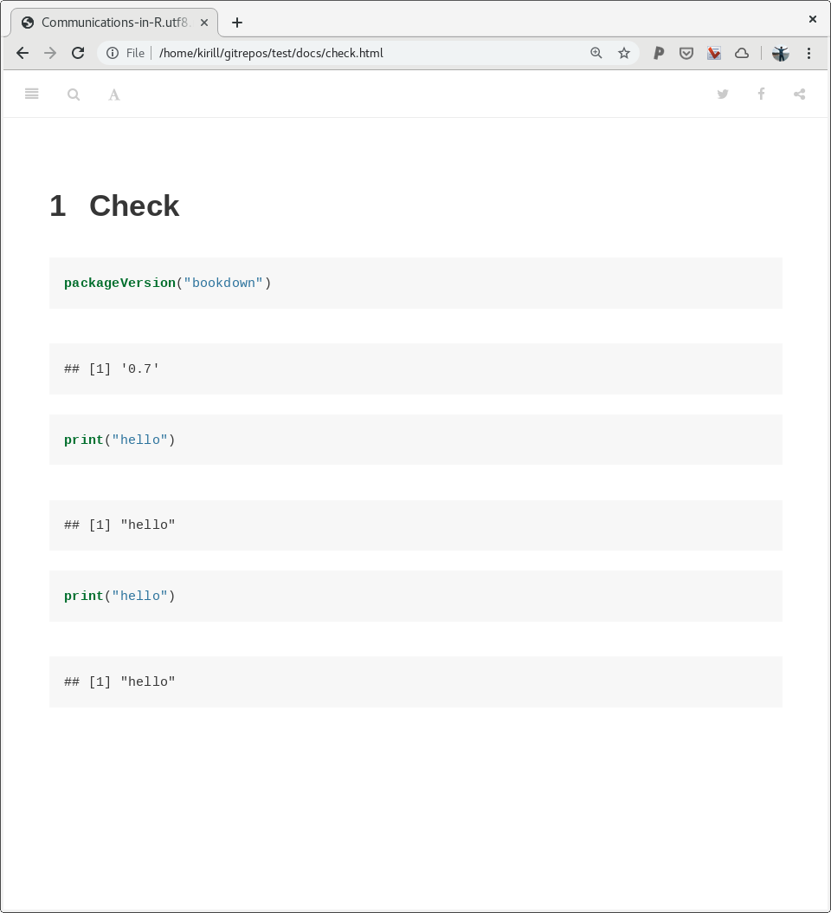

# Content

- [Bug?](#bug?)
- [Reproduce](#reproduce)
- [Info](#info)

## Bug?

not sure what's going on, but latest version of bookdown (0.11) isn't working. bookdown 0.7 seems to work, but still a bit buggy..

#### version 0.7



#### version 0.11


## Reproduce

```
git clone https://github.com/serine/test
cd test
make
firefox docs/check.html
```

## Info

```
(ins)[biostation2]~/gitrepos/test (master)$ make clean; make
rm -rf docs/* rm book/*.rds
if [ ! -d docs ];then mkdir docs;fi
cd book; \
Rscript -e "bookdown::render_book('.', 'bookdown::gitbook')"


processing file: check.Rmd
  |...........                                                      |  17%
  ordinary text without R code

  |......................                                           |  33%
label: unnamed-chunk-1
  |................................                                 |  50%
  ordinary text without R code

  |...........................................                      |  67%
label: unnamed-chunk-2
  |......................................................           |  83%
  ordinary text without R code

  |.................................................................| 100%
label: unnamed-chunk-3

output file: check.knit.md

/usr/bin/pandoc +RTS -K512m -RTS _main.utf8.md --to html4 --from markdown+autolink_bare_uris+ascii_identifiers+tex_math_single_backslash+smart --output _main.html --email-obfuscation none --wrap preserve --standalone --section-divs --table-of-contents --toc-depth 3 --template /home/kirill/R/x86_64-pc-linux-gnu-library/3.5/bookdown/templates/gitbook.html --highlight-style pygments --number-sections --include-in-header /tmp/Rtmpbc1Y6i/rmarkdown-str1fab6c389401.html --mathjax --metadata pagetitle=_main.utf8.md

Output created: ../docs/check.html
[1] "/home/kirill/gitrepos/test/docs/check.html"
```

```
which pandoc
/usr/bin/pandoc
```

```
pandoc --version
pandoc 2.7.3
Compiled with pandoc-types 1.17.5.4, texmath 0.11.2.2, skylighting 0.8.1
Default user data directory: /home/kirill/.local/share/pandoc or /home/kirill/.pandoc
Copyright (C) 2006-2019 John MacFarlane
Web:  http://pandoc.org
This is free software; see the source for copying conditions.
There is no warranty, not even for merchantability or fitness
for a particular purpose.
```

```
(ins)[biostation2]~/gitrepos/test (master)$ R

R version 3.5.1 (2018-07-02) -- "Feather Spray"
Copyright (C) 2018 The R Foundation for Statistical Computing
Platform: x86_64-pc-linux-gnu (64-bit)

R is free software and comes with ABSOLUTELY NO WARRANTY.
You are welcome to redistribute it under certain conditions.
Type 'license()' or 'licence()' for distribution details.

  Natural language support but running in an English locale

R is a collaborative project with many contributors.
Type 'contributors()' for more information and
'citation()' on how to cite R or R packages in publications.

Type 'demo()' for some demos, 'help()' for on-line help, or
'help.start()' for an HTML browser interface to help.
Type 'q()' to quit R.

(ins)> sessionInfo()
R version 3.5.1 (2018-07-02)
Platform: x86_64-pc-linux-gnu (64-bit)
Running under: Debian GNU/Linux 9 (stretch)

Matrix products: default
BLAS: /opt/R/3.5.1/lib/R/lib/libRblas.so
LAPACK: /opt/R/3.5.1/lib/R/lib/libRlapack.so

locale:
 [1] LC_CTYPE=en_AU.UTF-8       LC_NUMERIC=C
 [3] LC_TIME=en_AU.UTF-8        LC_COLLATE=en_AU.UTF-8
 [5] LC_MONETARY=en_AU.UTF-8    LC_MESSAGES=en_AU.UTF-8
 [7] LC_PAPER=en_AU.UTF-8       LC_NAME=C
 [9] LC_ADDRESS=C               LC_TELEPHONE=C
[11] LC_MEASUREMENT=en_AU.UTF-8 LC_IDENTIFICATION=C

attached base packages:
[1] stats     graphics  grDevices utils     datasets  methods   base

loaded via a namespace (and not attached):
[1] compiler_3.5.1
(ins)>
```
