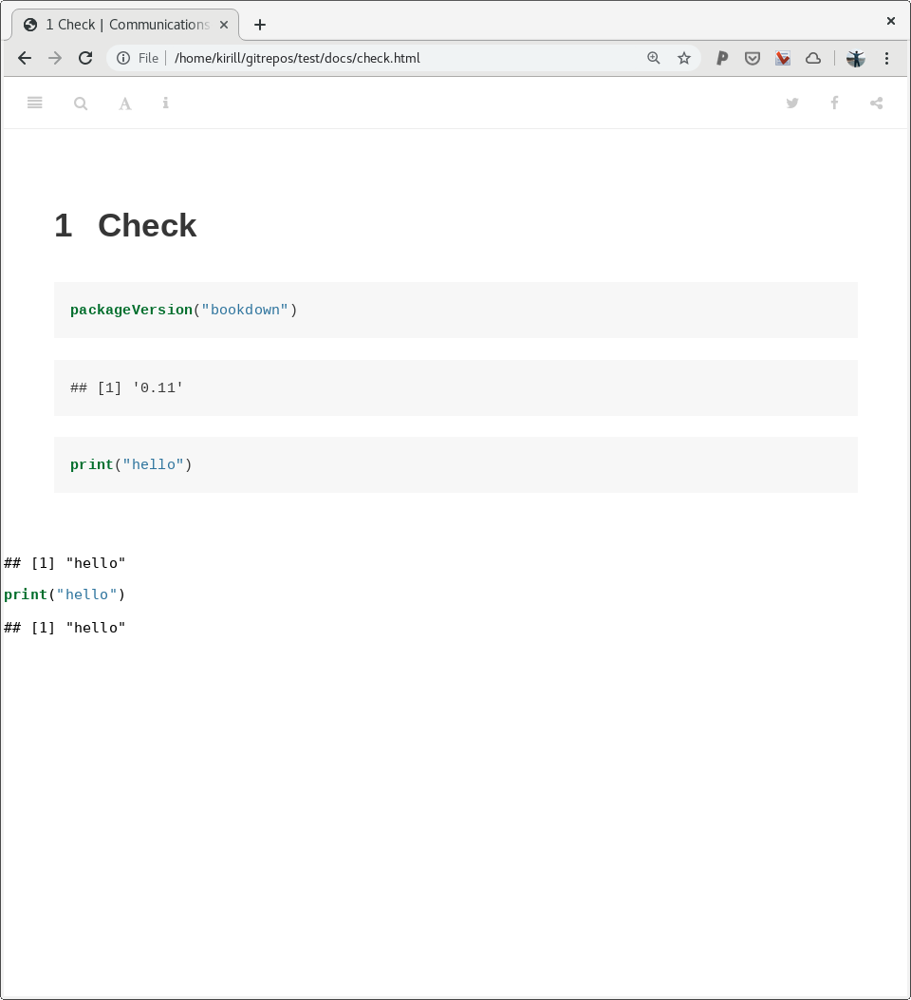

## Bug?

not sure what's going on, but latest version of bookdown (0.11) isn't working. bookdown 0.7 seems to work, but still a bit buggy..

#### version 0.7


#### version 0.11



## reproduce

```
git clone https://github.com/serine/test
cd test
make
firefox docs/check.html
```

```
(ins)[biostation2]~/gitrepos/test (master)$ make clean; make
rm -rf docs/* rm book/*.rds
if [ ! -d docs ];then mkdir docs;fi
cd book; \
Rscript -e "bookdown::render_book('.', 'bookdown::gitbook')"


processing file: check.Rmd
  |...........                                                      |  17%
  ordinary text without R code

  |......................                                           |  33%
label: unnamed-chunk-1
  |................................                                 |  50%
  ordinary text without R code

  |...........................................                      |  67%
label: unnamed-chunk-2
  |......................................................           |  83%
  ordinary text without R code

  |.................................................................| 100%
label: unnamed-chunk-3

output file: check.knit.md

/usr/bin/pandoc +RTS -K512m -RTS _main.utf8.md --to html4 --from markdown+autolink_bare_uris+ascii_identifiers+tex_math_single_backslash+smart --output _main.html --email-obfuscation none --wrap preserve --standalone --section-divs --table-of-contents --toc-depth 3 --template /home/kirill/R/x86_64-pc-linux-gnu-library/3.5/bookdown/templates/gitbook.html --highlight-style pygments --number-sections --include-in-header /tmp/Rtmpbc1Y6i/rmarkdown-str1fab6c389401.html --mathjax --metadata pagetitle=_main.utf8.md

Output created: ../docs/check.html
[1] "/home/kirill/gitrepos/test/docs/check.html"
```

```
which pandoc
/usr/bin/pandoc
```

```
pandoc --version
pandoc 2.7.3
Compiled with pandoc-types 1.17.5.4, texmath 0.11.2.2, skylighting 0.8.1
Default user data directory: /home/kirill/.local/share/pandoc or /home/kirill/.pandoc
Copyright (C) 2006-2019 John MacFarlane
Web:  http://pandoc.org
This is free software; see the source for copying conditions.
There is no warranty, not even for merchantability or fitness
for a particular purpose.
```
